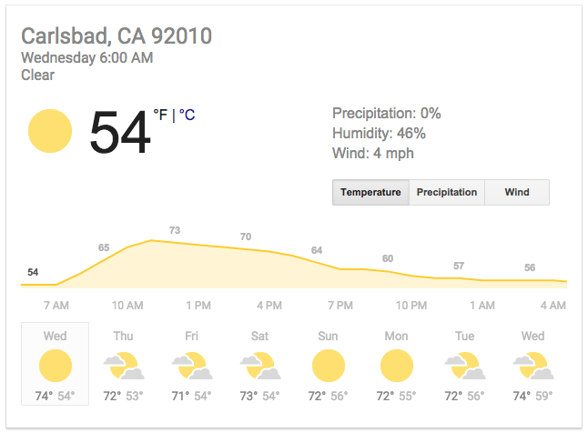

# How would you JSON the following image?

INSTRUCTIONS:
1. Replace the line 9 in the forecast.json file. 
2. Or replace all content if you want 

 
 
 
forecast.json

    {
    "forecast": [
        {
            "Wednesday": {
                "city": "Carlsbad",
                "state": "CA",
                "zip": "92010",
                "dayWeek": "Wednesday",
                "time": "Add your code here",
                "description": "Clear",
                "currentTemp": 54,
                "maxTemp": 74,
                "minTemp": 54,
                "precipitation": 0,
                "humidity": 46,
                "wind": 4
            }
        },
    }